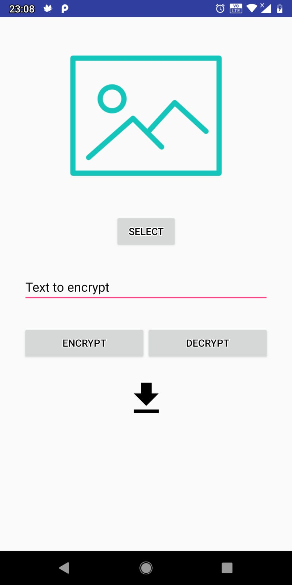
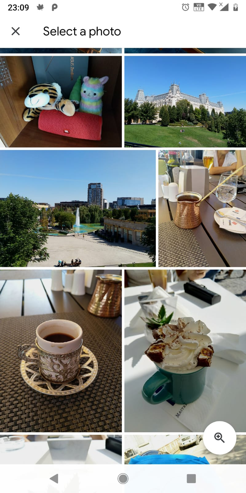
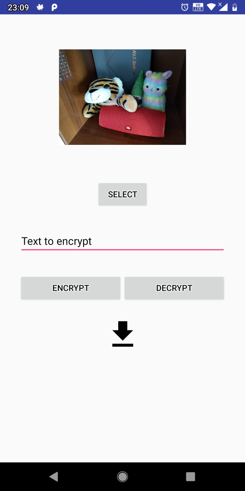
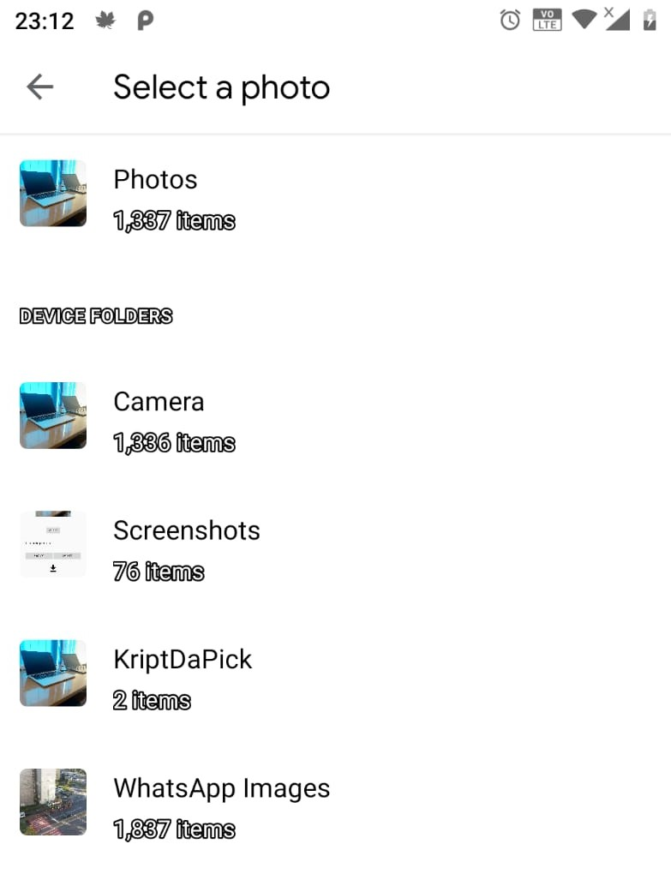
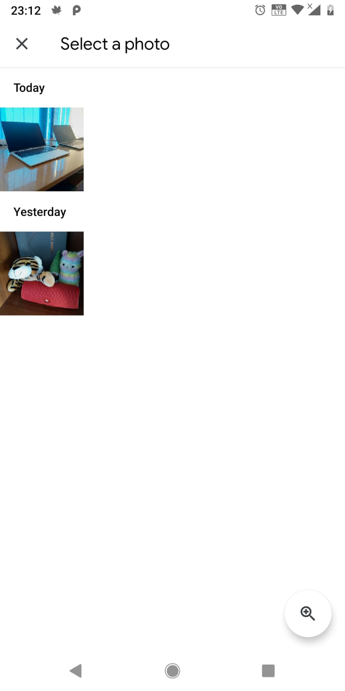
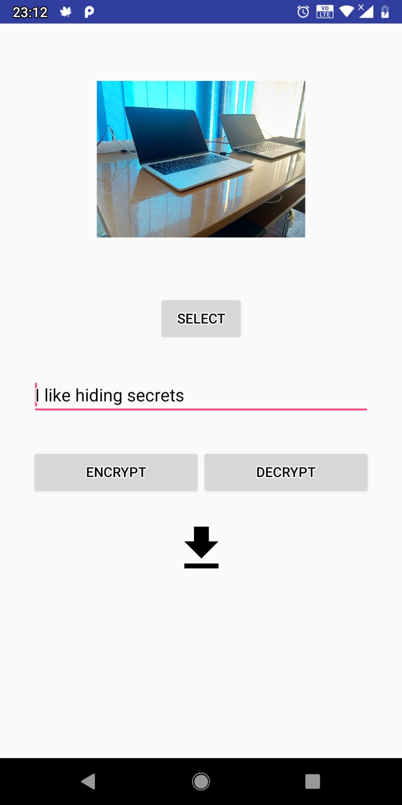

KriptDaPick
=============

Straightforward Android application with a minimalist GUI that lets the user
hide texts inside pictures.

## How does it work?

It takes the string (i.e. the message), converts it to a byte array and puts the bytes inside the least significant bits of the pixels of an image.

## UX

Firstly, the user has to select a picture. The picture can either be one which contains some hidden messages or not.

For now, let's assume that the user selects an image without any hidden messages.

By tapping "Select" a selection activity is brought up. The user can choose any picture stored on his device.

After the selection is made, the picture is loaded inside the application and shown.

The next step is to enter the desired message to hide, tap on "ENCRYPT" and then tap on the download icon.

Every image will be saved inside the "KriptDaPick" folder which is created automatically by the application.

Whenever the user wants to get his hidden messages he has to select a photo from the "KriptDaPick" folder (or from any other folder if he had moved the picture with the hidden message somewhere else).

After the image is loaded, the user taps the "DECRYPT" button and the hidden message will be prompted.

## Technologies used
- Android
- Kotlin
